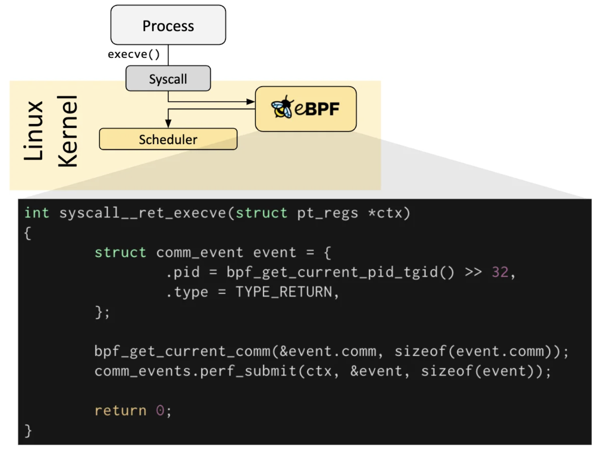

# eBPF Documentation

---

## Introduction to eBPF

### Hook Overview

- eBPF 프로그램은 이벤트 기반이며 커널 또는 애플리케이션이 특정 훅 포인트를 통과할 때 실행
- 사전 정의된 Hook에는 시스템 호출, 함수 입/출력, 커널 트레이스포인트, 네트워크 이벤트 등 여러 가지가 포함

- 특정 요구 사항에 대해 미리 정의된 Hook이 없는 경우 커널 프로브(kprobe) 또는 사용자 프로브(uprobe)를 생성하여 커널 또는 사용자 애플리케이션의 거의 모든 위치에 eBPF 프로그램을 첨부할 수 있음

### How are eBPF programs written

- 많은 시나리오에서 eBPF는 직접적으로 사용되지 않고 Cilium, bcc 또는 bpftrace와 같은 프로젝트를 통해 간접적으로 사용
- 프로젝트는 eBPF 위에 추상화를 제공하고 프로그램을 직접 작성할 필요 없이 인텐트 기반 정의를 지정한 다음 eBPF로 구현할 수 있는 기능을 제공

- 상위 수준의 추상화가 존재하지 않으면 프로그램을 작성해야 함
- Linux 커널은 바이트코드 형태로 eBPF 프로그램이 로드되기를 기대
- 바이트 코드를 직접 작성하는 것도 가능하지만, 더 일반적인 개발 관행은 `LLVM`과 같은 컴파일러 제품군을 활용하여 의사 C 코드를 eBPF 바이트 코드로 컴파일하는 것임

### Loader & Verification Architecture

- 원하는 Hook이 식별되면 bpf 시스템 호출을 사용하여 eBPF 프로그램을 Linux 커널에 로드할 수 있음
- 해당 작업은 일반적으로 사용 가능한 eBPF 라이브러리 중 하나를 사용하여 수행
- 프로그램이 Linux 커널에 로드되면 요청된 후크에 연결되기 전에 두 단계를 거침
  
    
    

### Verification

- 검증 단계에서는 eBPF 프로그램이 안전하게 실행될 수 있는지 확인(조건 충족 확인)
    - eBPF 프로그램을 로드하는 프로세스는 필요한 기능(권한)을 보유
    - 권한이 없는 ebpf가 활성화되어 있지 않으면 권한이 있는 프로세스만 eBPF 프로그램을 로드할 수 있음
    - 프로그램은 충돌하거나 시스템에 해를 끼치지 않음
    - 프로그램은 항상 완료될때까지 실행(즉, 프로그램이 영원히 루프에 앉아 추가 처리를 보류하지 않음)

### JIT Compilation

- JIT(Just-in-Time) 컴파일 단계는 프로그램의 일반 바이트코드를 머신별 명령어 집합으로 변환하여 프로그램의 실행 속도를 최적화함
- 이를 통해 eBPF 프로그램은 기본적으로 컴파일된 커널 코드나 커널 모듈로 로드된 코드만큼 효율적으로 실행

### Maps

- eBPF 프로그램의 중요한 측면은 수집된 정보를 공유하고 상태를 저장하는 기능
- 이를 위해 eBPF 프로그램은 eBPF 맵 개념을 활용하여 다양한 데이터 구조에 데이터를 저장하고 검색할 수 있음
- eBPF 맵은 시스템 콜을 통해 사용자 공간의 애플리케이션뿐만 아니라 eBPF 프로그램에 액세스할 수 있음
  
    
    
- 맴 유형의 불완전한 목록
    - Hash tables, Arrays
    - LRU (Least Recently Used)
    - Ring Buffer
    - Stack Trace
    - LPM (Longest Prefix match)

### Helper Calls

- eBPF 프로그램은 임의의 커널 함수를 호출할 수 없음
    - 이를 허용하면 eBPF 프로그램이 특정 커널 버전에 바인딩되어 프로그램 호환성이 복잡해질 수 있음
- 대신 eBPF 프로그램은 커널에서 제공하는 잘 알려져 있고 안정적인 API인 헬퍼 함수로 함수 호출을 할 수 있음
  
    
    
- 사용가능한 헬퍼 콜
    - Generate random numbers
    - Get current time & date
    - eBPF map access
    - Get process/cgroup context
    - Manipulate network packets and forwarding logic

### Tail & Function Calls

- eBPF 프로그램은 Tail 및 Function Call 개념으로 구성할 수 있음
- 함수 호출을 사용하면 eBPF 프로그램 내에서 함수를 정의하고 호출할 수 있음
    - Tail Call은 일반 프로세스에서 execve() 시스템 호출이 작동하는 방식과 유사하게 다른 eBPF 프로그램을 호출 및 실행하고 실행 컨텍스트를 대체할 수 있음

## Development Toolchains

### bcc

- bcc는 사용자가 eBPF 프로그램이 내장된 파이썬 프로그램을 작성할 수 있게 해주는 프레임워크
- 이 프레임워크는 주로 애플리케이션 및 시스템 프로파일링/추적과 관련된 사용 사례를 대상으로 하며, eBPF 프로그램이 통계를 수집하거나 이벤트를 생성하는데 사용되고 사용자 공간의 상대방이 데이터를 수집하여 사람이 읽을 수 있는 형태로 표시하는데 사용
- Python 프로그램을 실행하면 eBPF 바이트코드가 생성되어 커널에 로드 됨
  
    
    

### bpftrace

- bpftrace는 Linux eBPF를 위한 고급 tracing언어이며 준최신 Linux 커널(4.x)에서 사용할 수 있음
- bpftrace는 LLVM을 백엔드로 사용하여 스크립트를 eBPF 바이트코드로 컴파일하고 커널 동적 추적(kprobes), 사용자 수준 동적 추적(uprobes) 및 트레이스 포인트와 같은 기존 Linux Tracing 기능은 물론 Linux eBPF 하위 시스템과 상호 작용하기 위해 BCC를 사용
- bpftrace 언어는 awk, C, 그리고 DTrace 및 SystemTap과 같이 이전 tracers에게 영감을 받음
  
    
    

### eBPF Go Library

- eBPF Go 라이브러리는 eBPF 바이트코드로 이동하는 과정과 eBPF 프로그램의 로드 및 관리를 분리하는 일반 eBPF 라이브러리를 제공
- eBPF 프로그램은 일반적으로 상위 레벨 언어를 작성하여 만든 다음 clang/LLVM 컴파일러를 사용하여 eBPF 바이트코드로 컴파일하는 방식으로 만들어짐
  
    
    

### libbpf C/C++ Library

- libbpf 라이브러리는 C/C++ 기반의 일반 eBPF 라이브러리로, clang/LLVM 컴파일러에서 생성된 eBPF 객체 파일을 커널로 로드하는 것을 돕고 일반적으로 애플리케이션에 사용하기 쉬운 라이브러리를 API를 제공하여 BPF 시스템 호출과의 상호 작용을 추상화 함
  
    